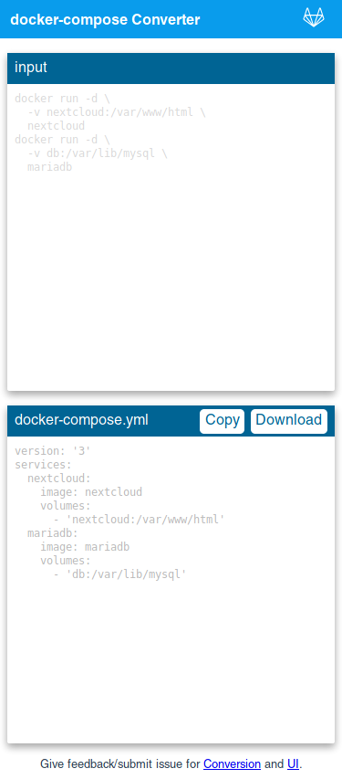

# docker-compose Converter Web

I've changed the index.html and .css under [/gh-pages](https://github.com/Griefed/dcc-web/tree/gh-pages) in order for the website to be deployed with regular apache's, for example a httpd:alpine docker container. 

---

Convert docker run/create commands to docker-compose.yml files.

[Webapp](https://bucherfa.github.io/dcc-web/)

Uses [docker-compose-converter](https://www.npmjs.com/package/docker-compose-converter)-library for the conversion. Submit issues for conversion at the [docker-compose-converter repo](https://github.com/bucherfa/docker-compose-converter/issues).



## General Project Setup

Build with the [vuejs cli](https://cli.vuejs.org/).

```
npm install
```

### Compiles and hot-reloads for development

```
npm run serve
```

### Compiles and minifies for production

```
npm run build
```

### Lints and fixes files
```
npm run lint
```
